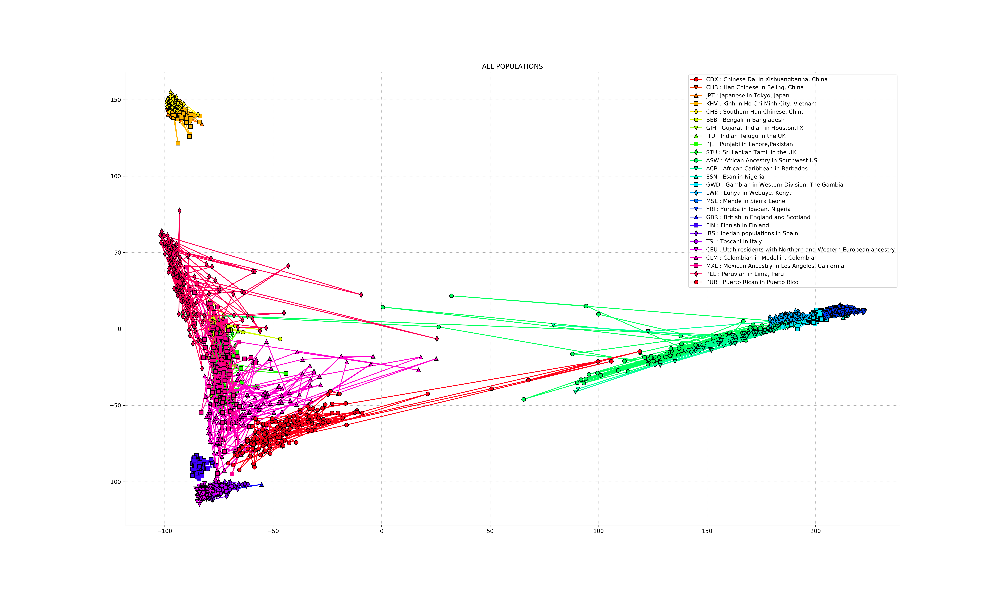
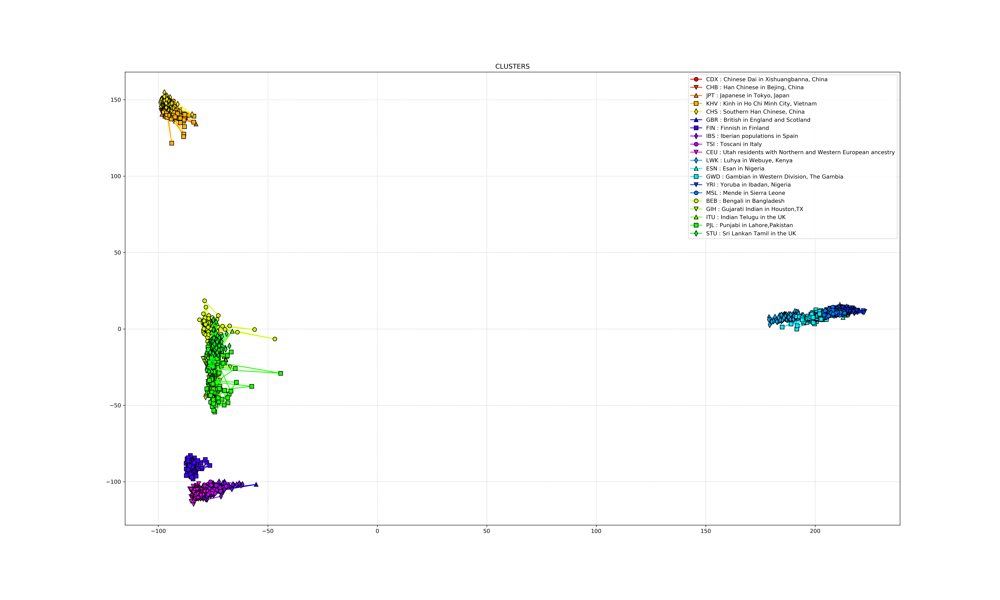
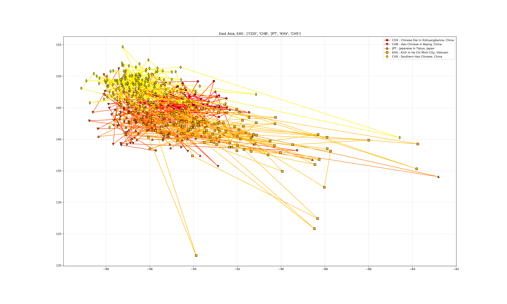
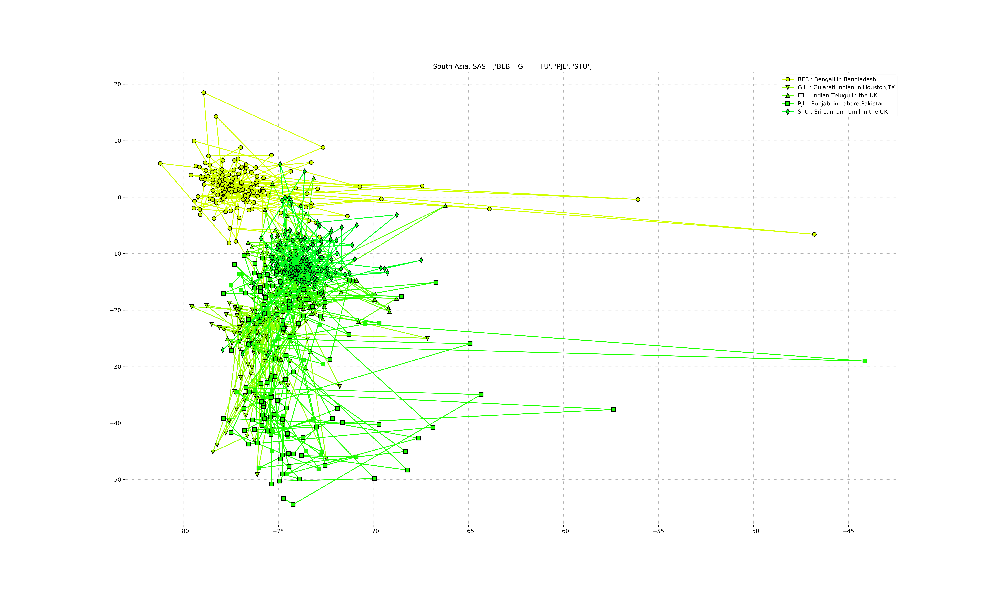
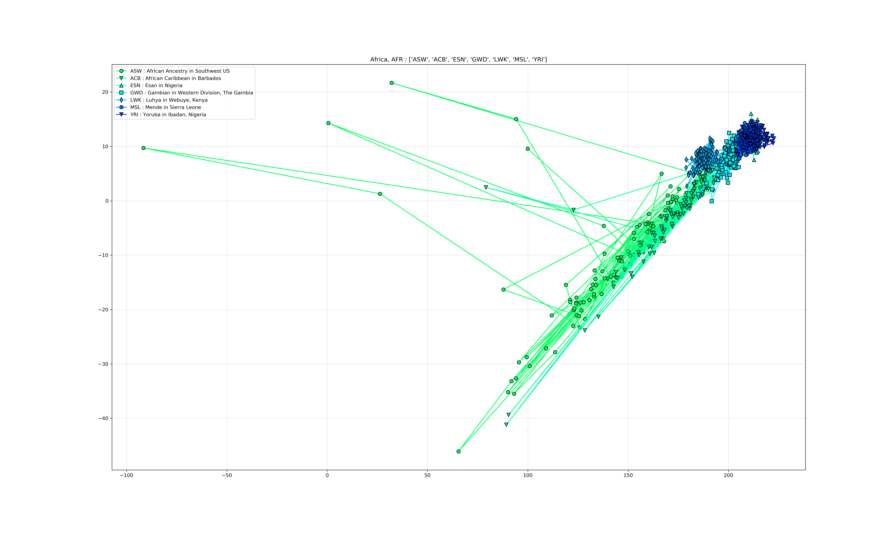
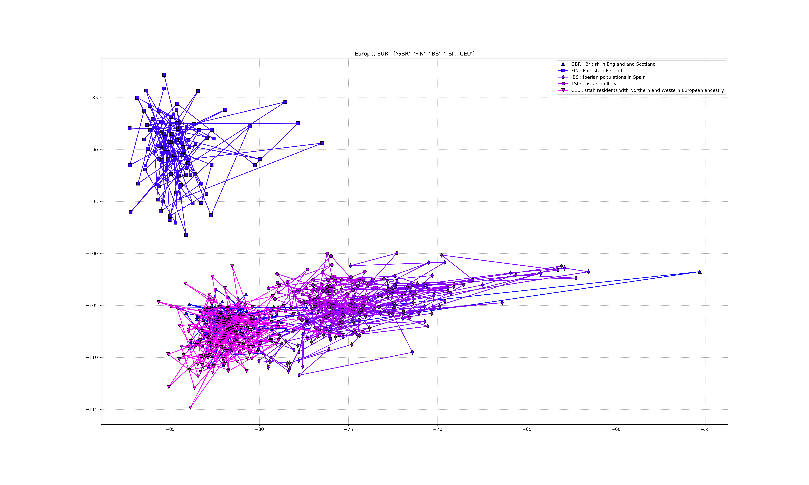
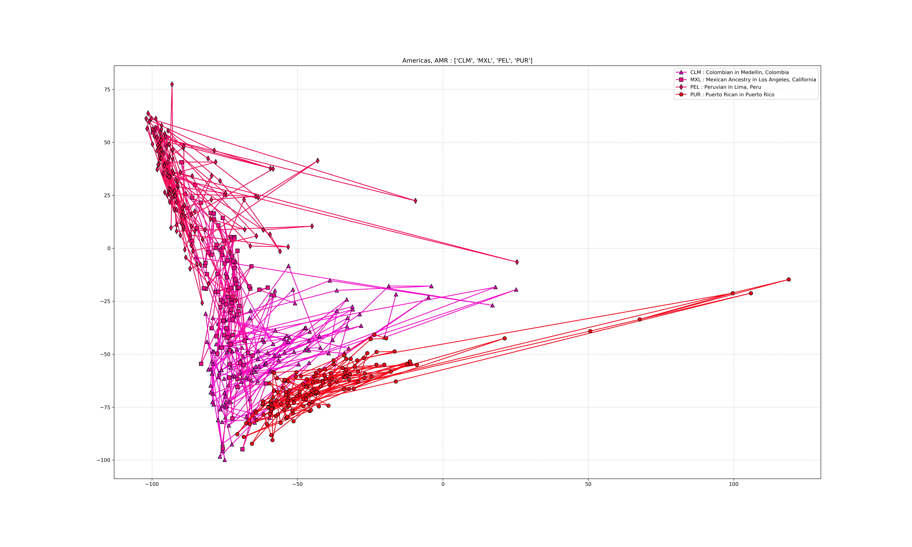
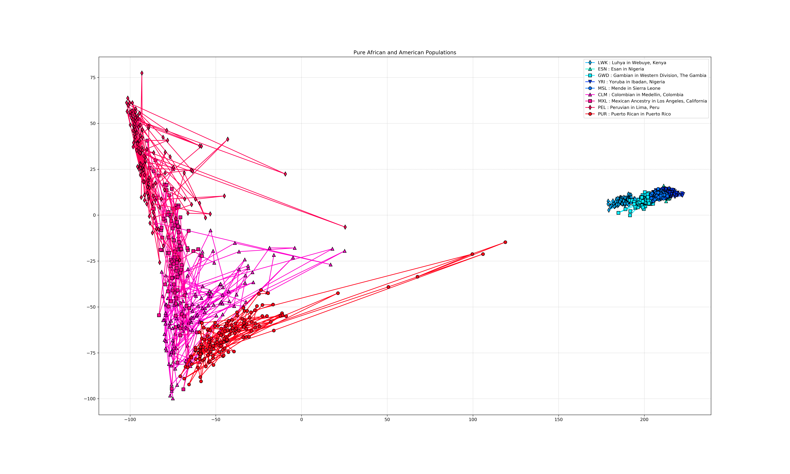
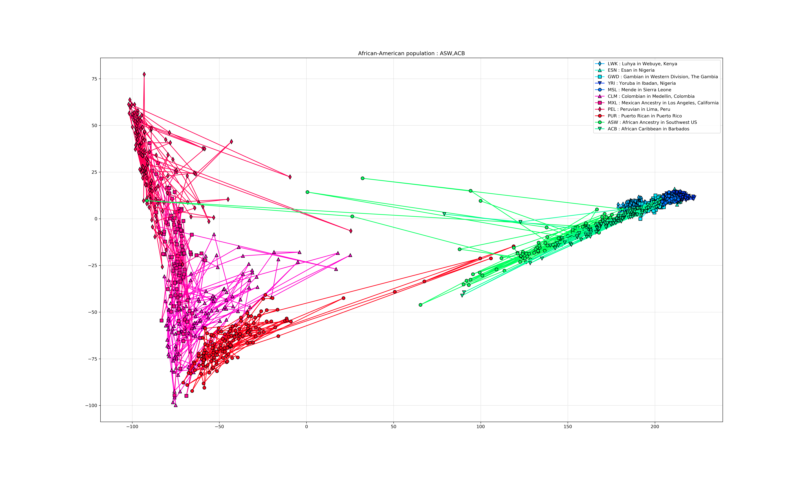

# Visualizing-genomic-data

* Main.ipynb contains an implementation of the script that reduces the dimensionality of data.
* log.txt contains the log for the script.
* coordinates.csv contains the low dimensional coordinates of the genomic data.
* The script saves high resolution plots in the root directory.
* 'allele_data_300k.zip' and 'axes_300k.txt' can be used to load pre-processed data to analyse the results.
* 'plot_300K_blank.png' and 'plot_300K_line.png' contain the output plots.
* '300k_with_seed' folder contains the miscellaneous plots.
* All images are in high resolution (300 dpi).

**_Reproducing the results :_**

* To completely rerun the script, the .vcf.gz file needs to be extracted into a .vcf file, whose path must then be given as an argument to read_save_data() function in the '[B] Reading Files' section.
* To just reproduce the graphs, move directly to section '[E] Backing up' and run the second cell to load the coordinates.
* Note : allele_data_300k.zip must be extracted into the main folder before running the script.
* The script takes about an hour to run (for the first time). 
* Subsequent runs take lesser time (about 35 minutes) as the data has been stored as a .npz file.
* It is possible to load the saved coordinates and run the script from section '[E] Backing up', in which case the results will be immediate as all the preprocessing has already been done.

## General Plots

* Plot showing all populations.

* Plot showing those populations that form clusters.

## Super Populations Plots
* East Asia

* South Asia

* Africa

* Europe

* America

## Plots relating to African-Americans

* Plot showing just Africa and America

* Plot including African-Americans

